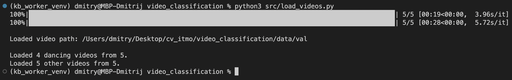
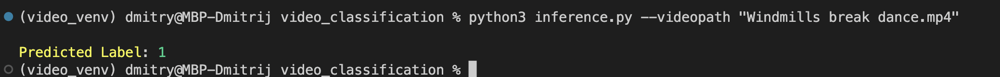

# Kinetics Video Classification

## Overview

Задача представляет собой классификацию видео из набора данных Kinetics 700-2020 с классами содержащими слово dancing.

**Задачи:**
 1. Обучить модель классификации этих видео (3DCNN, CNN-RNN, video transformer и тд)
 2. Сравнить с моделью обученной на отдельных кадрах
 3. Обучить модель классификации видео с другим подходом и провести сравнение

## Data

В качестве датасета был взят набор данных **Kinetics 700-2020**.
Ссылка на датасет: https://www.deepmind.com/open-source/kinetics

### Описание

Датасет содержит URL-ссылки, содержащие до 650 000 видеоклипов, охватывающих 700 классов действий человека. Видео включают в себя взаимодействия человека с объектом, например, игра на инструментах, а также взаимодействие человека с человеком, например, рукопожатие и объятия. Каждый класс действия имеет не менее 700 видеоклипов. Каждый клип аннотирован человеком с одним классом действия и длится около 10 секунд.

### Содержание

Набор данных содержит информацию об обучающей, валидационной и тестовой выборке в формате `.csv` и `.json`.

**CSV-таблицы** содержат следующие поля: `label,youtube_id,time_start,time_end,split`.

**JSON-файлы** содержат информацию о классе, id, а также `url-ссылки` для скачивания видео.

### Работа с данными

Для загрузки видео с YouTube была использована библиотека `PyTube` (https://github.com/pytube/pytube).

Также был написан скрипт `src/load_videos.py`, с помощью которого можно сразу загрузить и разделить видео на необходимые классы и в необходимые папки. Для этого в функцию `create_sample()` передается тип данных: `train` или `val` (возможность загрузить видео из `test`-выборки на данный отсутствует, так как там находятся данные без разметки) - а также размер видео на каждый класс (одинаково для каждого класса) `sample_size` и пути `path_to_data` - путь до csv- и json-файлов - и `path_to_save` - путь сохранения видео.



Также сохраняются csv-файлы с информацией о скачанных видео, которая может пригодится для выделения нужного фрагмента видео.

На данный момент в обучающей выборке содержится по 100 видео на класс, а также по 20 видеозаписей на валидационную выборку.

Обрезать фрагмент видео можно с помощью скрипта `src/cut_videos.py`, где в функцию `cut_video` передаем csv-файл с информацией о видео в определенном классе и путь для сохранения нарезанных фрагментов.

Например: 
```
    path = '/Users/dmitry/Desktop/cv_itmo/video_classification/data/train'
    dancing = pd.read_csv(os.path.join(path, 'sample_dancing.csv'))

    cut_video(dancing, os.path.join(path,'1/video/'))
```

Модель не может принимать на вход видео, поэтому их необходимо разделить на кадры (изображения). Это можно сделать с помощью скрипта `src/crop_frames.py`.
Нужно указать путь до видео определенного класса и опционально путь (продолжение первого пути, лежат внутри него) до нарезанных фрагментов.
```
path = '/Users/dmitry/Desktop/cv_itmo/video_classification/data/val/0/'
crop_images(path, cut_folder='cut_videos')
```

С каждого видео нарезается порядка 100 кадров или меньше, если видео содержит менее 100 кадров.

## Model

В качестве модели для предсказания класса видео был использован подход CNN + RNN, так как он помогает не только извлечь фичи из изображений и на их основе сделать предсказание, но также позволяет использовать семантическую информацию - связать кадры между собой.

В качестве экстрактора фич была использована предобученная модель `Resnet18` из библиотеки `torchvision`, а в качестве рекуррентной модели - `LSTM` из `torch.nn`. Реализация представлена в модуле `src/model.py`.

## Training

### Video classification

Для обучения подавались батчи размером 4, каждый элемент которого содержит по 4 последовательных кадра с каждого видео. Таким образом, один батч обучения имеет следующий размер - `(4,4,3,224,224)`.

На данный момент проведена одна итерация обучения на `10 эпохах`.


### Image classification

Также в качестве классификации видео был опробован самый простой подход - классифицировать каждый кадр видео по-отдельности и усреднять предсказания для получения итогового лейбла. Данный подход представлен в ноутбуке `image_classification.ipynb`.

Обучение проходила с теми же параметрами обучения (epochs, batch-size, criterion, optimizer,), как и в первом случае, для более точного сравнения подходов.

### Results

Метрики обучения можно посмотреть в WandB: https://wandb.ai/cv-itmo/video_classification?workspace=user-dmitryai

Графики лоссов и метрики скора примерно сопоставимые - на обучении чуть лучше себя показал второй подход, на валидации - первый. Однако, на тестовой выборке **количество правильных ответов больше у второго подхода примерно на 4%**:
```
accuracy_score: 0.7941176470588235 # video classification
accuracy_score: 0.8310669456066946 # image classification
```

## Inference

Для инференса видео можно воспользоваться скриптом `inference.py`. Видео должно быть в формате '.avi' или `.mp4`. Запуск осуществляется командой `python3 inference.py` с указанием пути до видео: `python3 inference.py --videopath inference.mp4`.

Также можно указать дополнительные параметры:
* `--model-path` - путь до чекпоинта обученной модели;
* `--save-frames-path` - путь до папки, куда будут сохранены нарезанные с видео кадры;
* `--rm-frames` - флаг: удалить папку с нарезанными кадрами по завершению или оставить (по дефолту `True`);
* `--start-time` - точка в секундах, с которой необходимо начать обрезку видео;
* `--end-time` - точка в секундах, с которой необходимо закончить обрезку видео;
* `--duration` - время в секундах, которое необходимо отсчитать от точки начала обрезки видео.

Если указано время начало, но не указана точка конца обрезки видео, то возникнет ошибка. Обрезанное видео сохранится как `REAL_VIDEONAME_cut.mp4`.

Для инференса видео и модель можно скачать с Google.Drive: https://drive.google.com/drive/folders/1FZheBVqYYltBfJlsvU5ZbxRxEQ7VZikg?usp=sharing

Пример инференса:


